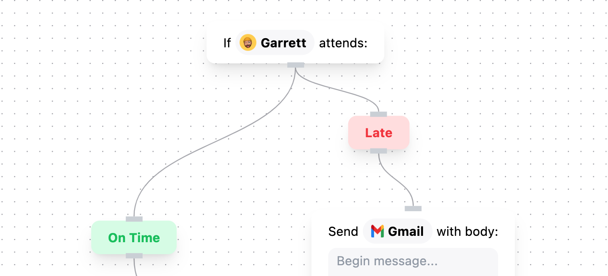

# Amie Flow



## Table of Contents

- [General Info](#general-information)
- [Instructions](#instructions)
- [Technologies Used](#technologies-used)
- [Notes](#notes)

## General Information

I tried to imagine a way for more complex decision making to be done in a simple and beautiful format. Node and decision tress are typically ugly, so thought it might be fun to make it look a bit more approachable.

Note: This is only a work in progress and proof of concept. I have not yet implemented the logic to make add and manipulate nodes as well as complex node logic.

## Instructions

You can view the live demo [here](https://amie-flow-garrettprince.vercel.app/). Click on the 'Flow' button to see the flow chart section.

Or clone the repo using the following command:


```
git clone https://github.com/garrettprince/amie-flow
```
Install the dependencies using:
```
npm install
```
And run the development server using:
```
npm run dev
```

## Technologies Used

- Next.js v14.0.4
- Jotai v2.6.0
- Tailwind v3.3.6
- Framer Motion v10.16.16
- React Flow v11.10.1

## Notes

- I spent about 8 hours total over 2 days on this project.
- Had a blast understanding and stying custom nodes from the React Flow library.
- Would love to hook it up to a database and add the logic to add and manipulate nodes that persist after authentication from a single user.
- In addition, I can see this logic living in a separate section if these types of decision trees can clog up an invite interface.
